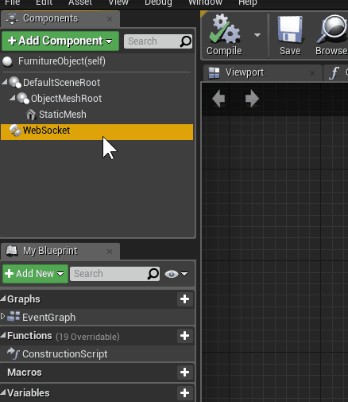

# Teste DECORADO - Posicionamento de móveis
## Descrição
Game de posicionamento de móveis em ambiente 3D.
## Funcionalidades
### Seleção de móveis
Clique no menu lateral para selecionar um móvel na lista. Ao clicar, basta posicionar o móvel no cenário e pressionar `Botão Esquerdo do Mouse` para confirmar. Podem ser utilizados os atalhos correspondentes as teclas `1` a `9`
<center>


</center>


### Menu de opções
Ao selecionar um móvel, um menu é exibido com botões de ações que podem ser executadas pelo usuário.
<center>


</center>

Ícone                                     |  Nome          |  Descrição
:----------------------------------------:|:--------------:|:------------:
   |  Close         |  Fecha menu
    |  Move          |  Movimenta objeto
  |  Rotate        |  Rotaciona objeto
    |  Sync WebSocket|  Sincroniza objeto com rotação fornecida por um WebSocket
  |  Delete        |  Deleta Objeto
 |  Change Texture|  Altera textura do objeto (atalhos nas teclas `Cima` e `Baixo`)

<center>


Alterar Textura


Sincronizar com WebSocket
</center>

### WebSocket Component
Actor Component para consumo de dados via WebSocket. Componente criado em C++ utilizando a biblioteca `WebSocket++`.

<center>



Actor Component disponível para qualquer ator.


Disparo de evento ao receber mensagens do servidor.


Exemplo.

</center>

Servidor do exemplo acima:
```python
#!/usr/bin/python
from sys import stdout
from time import sleep

# Count from 1 to 10 with a sleep
count = 0
while (True):
  print(count)
  count = (count + 1) % 360
  stdout.flush()
  sleep(0.01)
```


## Cumprimento de Requisitos

### Requisitos funcionais 1
- [x] Desenvolva um game simples, para posicionamento de móveis em um ambiente

- [x] Ao clicar no teclado, na tecla "1" ele deverá inserir um móvel, na tecla "2" outro, e assim por diante até chegar na tecla "9";
        
- [x] Ao clicar no atalho para inserir o móvel, este aparecerá no ambiente, e com o mouse ele poderá ser re-posicionado (rotacionado inclusive);

- [x] Ao clicar nas teclas up e down troca textura do móvel selecionado;

### Requisitos não funcionais 1
- [x] Utilizar a plataforma de games UNREAL para desenvolvimento deste aplicativo


### Requisitos funcionais 2
- [x] O aplicativo deverá conter uma cadeira e a cadeira deverá girar conforme envio de comando via http websocket;

### Requisitos não-funcionais 2:
- [x] Utilizar a plataforma de games UNREAL para desenvolvimento deste aplicativo;

- [x] No projeto inicial de demo unreal, são exibidas 2 cadeiras, utilizar somente uma cadeira, ela irá receber os comandos para girar;

- [x] Importar pro seu projeto no unreal uma biblioteca c++ cliente de websocket para se conectar ao servidor (sugestão: https://github.com/zaphoyd/websocketpp);

- [x] Subir um servidor websocket simples, que a sua lib em C++ irá se conectar, sugestão http://websocketd.com/ ;

- [x] A aplicação irá se conectar ao servidor websocket e ouvir as requisições com comando para girar a cadeira
        
- [ ] Deverá ter uma implementação simples de um client em html/javascript, que se conectará com o seu servidor web-socket e enviará o comando para girar a cadeira.

## Detalhes técnicos
### Projeto
* Versão da Unreal Engine: 4.18.1
* Binários compilados com Visual Studio 2015 (VC 14.0)
### Biblioteca Boost
* Versão 1.65.1
* Binários pré-compilados com VC 14.0
* Dependência de WebSocket++
### Biblioteca WebSocket++
* Versão 0.7.0
### Servidor WebSocket
* IP: 138.197.172.94
* Porta: 9002 